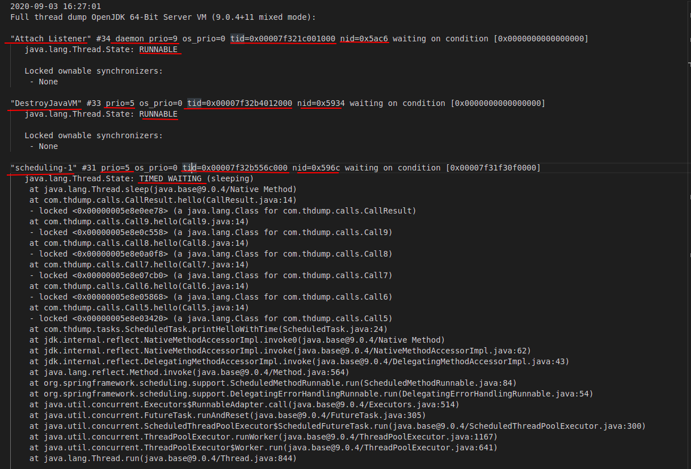
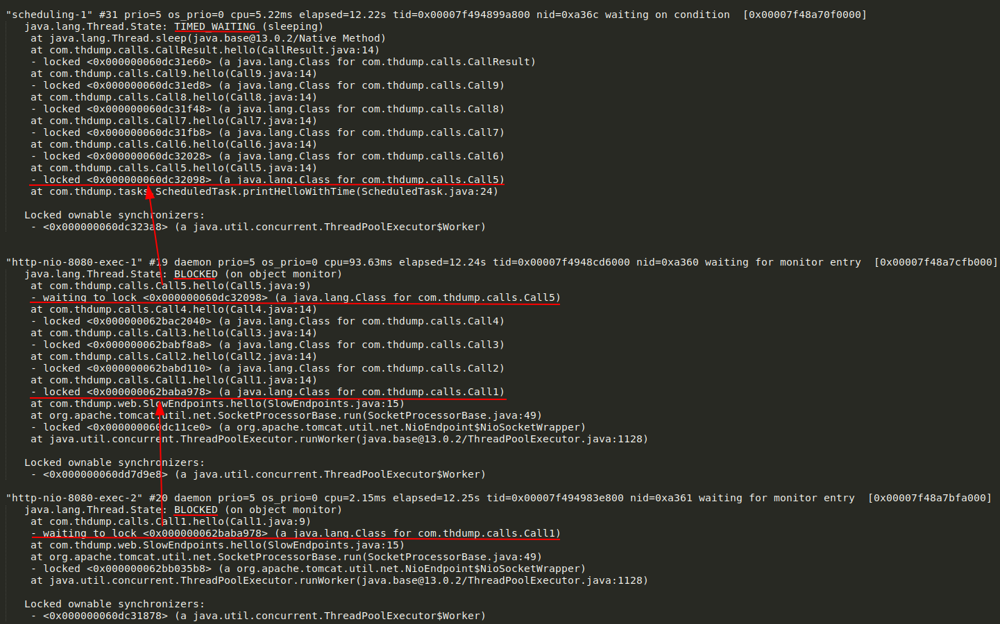

# General usage

```go
threads, err := jthreadparser.ParseFromFile(os.Args[1])

if err != nil {
    log.Fatal(err)
}

for _, th := range threads {
    fmt.Println(th.Name)
    fmt.Println(th.Priority)
    fmt.Println(th.NativeID)
    fmt.Println(th.State)
    fmt.Println(th.StackTrace)
}
```

Above code will help you to get this information from a thread dump file:



#### Output

<pre>
'Attach Listener' (0x00007f321c001000) (0x5ac6) [RUNNABLE]
'DestroyJavaVM' (0x00007f32b4012000) (0x5934) [RUNNABLE]
'scheduling-1' (0x00007f32b556c000) (0x596c) [TIMED_WAITING]
'http-nio-8080-Acceptor' (0x00007f32b53d7000) (0x596b) [RUNNABLE]
'http-nio-8080-ClientPoller' (0x00007f32b53f1000) (0x596a) [RUNNABLE]
</pre>


### Synchronizers

To get information about which threads are waiting on what (synchronizer states) you can use the *SynchronizersByThread()* method:

```go
threadDumpFile := "../../threaddumpsamples/13.0.2.0.txt"

threads, err := jthreadparser.ParseFromFile(threadDumpFile)
if err != nil {
    panic(err)
}

syncs := jthreadparser.SynchronizersByThread(&threads)
for thread, threadSyncs := range syncs {
    fmt.Printf("Thread [%s (%s)], synchronizers: %q\n", thread.Name, thread.ID, threadSyncs)
}
```



#### Output
<pre>
...
Thread [<b>scheduling-1</b> (0x00007f494899a800)]
	{0x000000060dc31e60 java.lang.Class for com.thdump.calls.CallResult LockedState}
	{0x000000060dc31ed8 java.lang.Class for com.thdump.calls.Call9 LockedState}
	{0x000000060dc31f48 java.lang.Class for com.thdump.calls.Call8 LockedState}
	{0x000000060dc31fb8 java.lang.Class for com.thdump.calls.Call7 LockedState}
	{0x000000060dc32028 java.lang.Class for com.thdump.calls.Call6 LockedState}
	{<b>0x000000060dc32098</b> java.lang.Class for com.thdump.calls.Call5 <b>LockedState</b>}
...
Thread [<b>http-nio-8080-exec-1</b> (0x00007f4948cd6000)]
	{<b>0x000000060dc32098</b> java.lang.Class for com.thdump.calls.Call5 <b>WaitingToLockState</b>}
	{0x000000062bac2040 java.lang.Class for com.thdump.calls.Call4 LockedState}
	{0x000000062babf8a8 java.lang.Class for com.thdump.calls.Call3 LockedState}
	{0x000000062babd110 java.lang.Class for com.thdump.calls.Call2 LockedState}
	{<b>0x000000062baba978</b> java.lang.Class for com.thdump.calls.Call1 <b>LockedState</b>}
	{0x000000060dc11ce0 org.apache.tomcat.util.net.NioEndpoint$NioSocketWrapper LockedState}
...
Thread [<b>http-nio-8080-exec-2</b> (0x00007f494983e800)]
	{<b>0x000000062baba978</b> java.lang.Class for com.thdump.calls.Call1 <b>WaitingToLockState</b>}
	{0x000000062bb035b8 org.apache.tomcat.util.net.NioEndpoint$NioSocketWrapper LockedState}
...
</pre>

### Reading from stdin

You can read from standard input with the **ParseFrom(X)**:

```Go
threads, err := jthreadparser.ParseFrom(os.Stdin)
```

```bash
jstack -l PID | go run myprogram.go
```

<pre>
</pre>

### Most Used Methods

You can check how many threads include a specific Method using the MostUsedMethods() function:

```go
threads, err := jthreadparser.ParseFromFile("thread_dump.txt")
...

mostUsedMethods := jthreadparser.MostUsedMethods(&threads)
for javaMethodName, threadCount := range mostUsedMethods {
    fmt.Printf("%d thread(s) having '%s'\n", threadCount, javaMethodName)
}
```

Output:
```
...
241 thread(s) having 'java.util.concurrent.ThreadPoolExecutor.getTask(ThreadPoolExecutor.java:1074)'
233 thread(s) having 'java.util.concurrent.LinkedBlockingQueue.take(LinkedBlockingQueue.java:442)'
59 thread(s) having 'java.util.concurrent.ThreadPoolExecutor.runWorker(ThreadPoolExecutor.java:1149)'
...
```

### Threads with same stacktrace

```go
threads, err := jthreadparser.ParseFromFile("thread_dump.txt")
...
indenticalStackTrace := jthreadparser.IdenticalStackTrace(&threads)

for stackTrace, threadCount := range indenticalStackTrace {
    fmt.Printf("%d threads having this stacktrace: \n", threadCount)
    fmt.Println(stackTrace)
}
```

Output:
```
...
20 threads having this stacktrace: 
at sun.misc.Unsafe.park(Native Method)
- parking to wait for  <0x000000074efc2310> (a java.util.concurrent.locks.AbstractQueuedSynchronizer$ConditionObject)
at java.util.concurrent.locks.LockSupport.park(LockSupport.java:156)
at java.util.concurrent.locks.AbstractQueuedSynchronizer$ConditionObject.await(AbstractQueuedSynchronizer.java:1987)
at java.util.concurrent.LinkedBlockingQueue.take(LinkedBlockingQueue.java:399)
at java.util.concurrent.ThreadPoolExecutor.getTask(ThreadPoolExecutor.java:957)
at java.util.concurrent.ThreadPoolExecutor$Worker.run(ThreadPoolExecutor.java:917)
at java.lang.Thread.run(Thread.java:682)
1 threads having this stacktrace: 
at java.lang.Object.wait(Native Method)
- waiting on <0x000000075c8e5d40> (a atg.service.datacollection.DataCollectorQueue)
at java.lang.Object.wait(Object.java:485)
at atg.service.queue.EventQueue.getElement(EventQueue.java:236)
- locked <0x000000075c8e5d40> (a atg.service.datacollection.DataCollectorQueue)
at atg.service.queue.EventQueue.dispatchQueueElements(EventQueue.java:285)
at atg.service.queue.EventQueue$Handler.run(EventQueue.java:91)
1 threads having this stacktrace: 
at java.lang.Object.wait(Native Method)
...
```